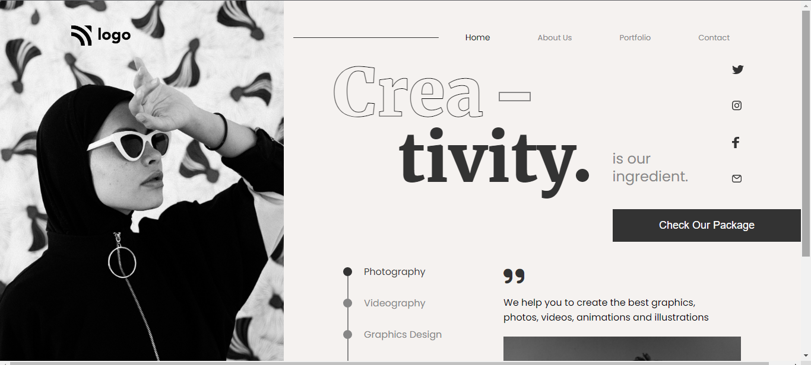

# Project 14

<!-- ## Project 14 [Live Link](https://live-proj-14.netlify.app) -->

-   Skills Gained in this project
    -   Since this project is heavily based on positioning,
        Learned a lot about relative & absolute.
    -   Learned to use **text-stroke-width** to create outline text effect.
    -   Also Learned to create stepper using list item & div (By using relative & absolute)

---

## Time taken to finish this project

-   7 hour taken to complete it 

# Preview

